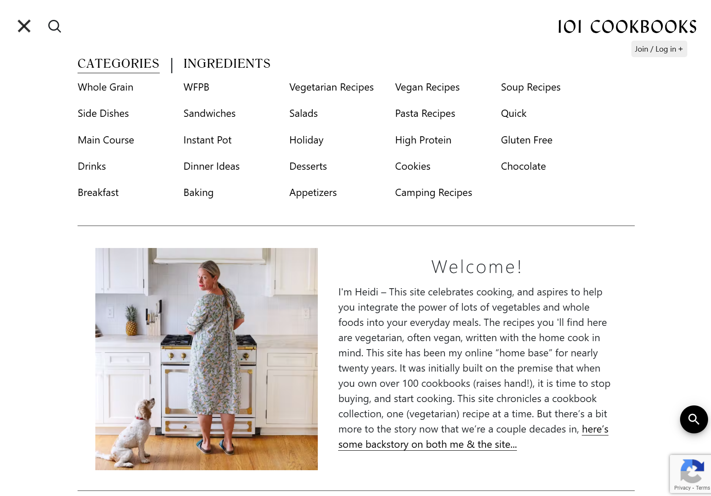

# Jingjie Gao Individual Project - Recipe Store

### Problem Statement
Cooking is a relaxing hobby for many people, including me. When I eat a delicious dish at a restaurant, I always search for the recipe online, write it down, and try cooking it at home. However, I believe many people find it challenging to manage a growing collection of recipes. With recipes scattered across different notes, it becomes difficult to find and organize them efficiently. Developing a digital solution is more convenient than writing them on paper. The Recipe Store application will be developed similarly to the [101 Cookbooks website](https://www.101cookbooks.com/), organizing recipes by category. A key difference is that the Recipe Store application is a personal recipe organizer that allows users to manage their own recipes and access them easily. Users can easily add new recipes, update them, and even delete them when needed.

Screenshots from the 101 Cookbooks:

### Project Technologies/Techniques
* Security/Authentication
  - AWS Cognito
* Database
  - MySQL 8.x
* ORM Framework
  - Hibernate Version TBD
* Dependency Management
  - Maven
* Web Services consumed using Java
  - TBD
* CSS
  - Bootstrap
* Data Validation
  - Bootstrap Validator for front end
* Logging
  - Log4J2
* Hosting
  - AWS
* Project Lombok
* Unit Testing
  - JUnit tests to cover all testable logic
* IDE: IntelliJ IDEA

### Design
* [User Stories](DesignDocuments/UserStories.md)
* [Screen Design](DesignDocuments/Screens.md)

### [Project Plan](ProjectPlan.md)

### [Time Log](TimeLog.md)

